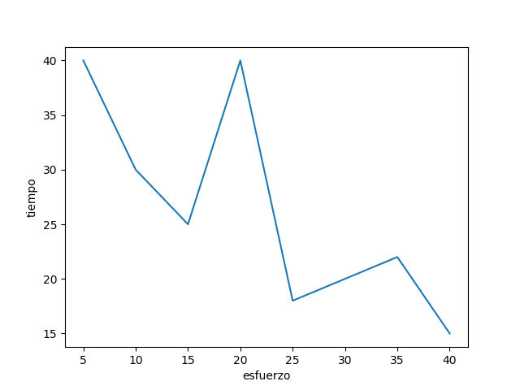

# Polinomios de interpolación de Lagrange

Es una reformulación del polinomio de Newton, que evita el cálculo de las diferencias divididas. Se representa como:
$$
f_n(x) = \sum^{n}_{i=0} = L_i(x) f(x_i)
$$
donde
$$
L_i(x) = \Pi^{n}_{j=0\\ j=i} \frac{x-x_j}{x_i -x_j}
$$
La versión de primer grado es: 
$$
f_1(x) = \frac{x-x_1}{x_0 - x_1}f(x_0) + \frac{x-x_0}{x_1 - x_0}f(x_1)
$$
La versión de segundo grado es:
$$
f_2(x) = \frac{x-x_1}{x_0 - x_1}\frac{x-x_2}{x_0-x_2}f(x_0) + \frac{x-x_0}{x_1 - x_0}\frac{x-x_0}{x_1-x_2}f(x_1) + \frac{x-x_0}{x_2}\frac{x-x_1}{x_2 - x_1}f(x)
$$
La versión de tercer grado es:
$$
f_3(x) = \frac{x-x_1}{x_0 - x_1}\frac{x-x_2}{x_0-x_2}\frac{x-x_3}{x_0-x_3}f(x_0) + \frac{x-x_0}{x_1-x_0}\frac{x-x_2}{x_1-x_2}\frac{x-x_3}{x_1-x_3}f(x_1) + \frac{x-x_0}{x_2-x_0}\frac{x-x_1}{x_2-x_1}\frac{x-x_3}{x_2-x_3}f(x_2) + \frac{x-x_0}{x_3-x_0}\frac{x-x_1}{x_3-x_1}\frac{x-x_2}{x_3-x_2}f(x_3)
$$
**Ejemplo.** Se mide con gran precisión la corriente en un conductor como una función del tiempo:

|       |      |        |       |        |        |
| ----- | ---- | ------ | ----- | ------ | ------ |
| **t** | 0    | 0.1250 | 0.250 | 0.3750 | 0.5000 |
| **i** | 0    | 6.24   | 7.75  | 4.83   | 0.0000 |

Determinar el valor de i en t = 0.23

Con un polinomio de primer grado, $i_1 (0.23) = 7.5084$

Con un polinomio de segundo grado, $i_2(0.23) = 7.8048$

**Ejercicio (1)** Se realiza un experimento para definir la relación entre el esfuerzo aplicado y el tiempo para que se fracture cierto tipo de acero inoxidable. Se aplican  8 valores distintos de esfuerzo, y los datos resultantes son:

| Esfuerzo aplicado, $kg/mm^2$ | 5    | 10   | 15   | 20   | 25   | 30   | 35   | 40   |
| ---------------------------- | ---- | ---- | ---- | ---- | ---- | ---- | ---- | ---- |
| Tiempo para la fractura $t$  | 40   | 30   | 25   | 40   | 18   | 20   | 22   | 15   |

Estime el tiempo de fractura para un esfuerzo aplicado de: 

- $13 kg/mm^2$ es de: 25.44

- $28kg/mm^2$ es de: 17.8560

<small>Mayo 29, 2019</small>

**Ejercicio (2).** El volumen específico de un vapor sobrecalentado se enlista en tablas de vapor para distintas temperaturas. Por ejemplo, a una presión absoluta de 3000 $lb/in^2$ se tiene 

| T, °f        | 700    | 720     | 740    | 760     | 780      |
| ------------ | ------ | ------- | ------ | ------- | -------- |
| **V, ft/lb** | 0.0977 | 0.12184 | 0.1406 | 0.15509 | 0.016643 |

Polinomio de segundo grado
$$
V(T) = \frac{(T-760)}{(740-760)}\frac{(T-780)}{(740-780)}(0.1406) + \frac{(T-740)}{(760-740)}\frac{(T-780)}{(760-780)}(0.15509)+\frac{(T-740)}{(780-740)}\frac{(T-760)}{(780-760)}(0.16643)
$$
Con polinomio de 3er grado para T=750 (desde 720  hasta 780) = 0.14830875