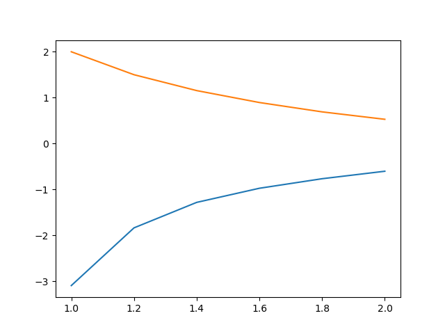
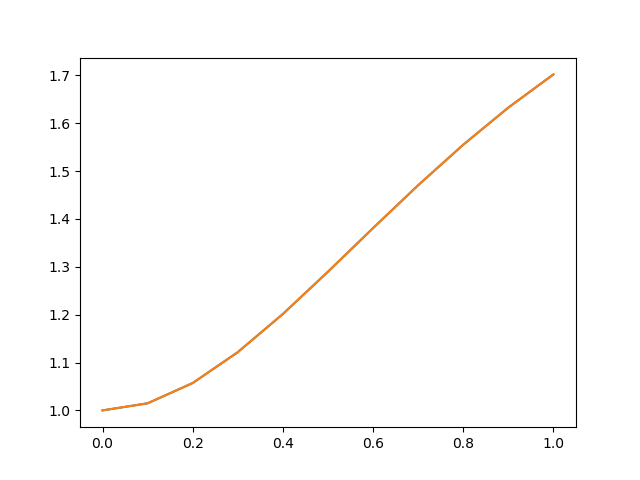

## Ingeniera en Sistemas Computacionales

### Métodos numéricos en ingeniería 

### Cuarta evaluación

**Nombre:** Isaac Benjamin Espinosa Ramos

**Fecha: **Junio 14, 2019

1.-  Use diferencias dividas de Newton para construir polinomios de interpolación de grado uno, dos y tres con los siguientes datos. Aproxime el valor **f(-1/3)** usando cada uno de los polinomios.

| x        | -0.75       | -0.5        | -0.25      | 0     |
| -------- | ----------- | ----------- | ---------- | ----- |
| **x(f)** | -0.07181250 | -0.02475000 | 0.33493750 | 1.101 |

**Solución**

| No   | x     | f(x)       | Primero | Segundo | Tercero     |
| ---- | ----- | ---------- | ------- | ------- | ----------- |
| 1    | -0.75 | -0.7118125 |         |         |             |
|      |       |            | 2.74825 |         |             |
| 2    | -0.5  | -0.02475   |         | -2.619  |             |
|      |       |            | 1.43875 |         | 7.826666667 |
| 3    | -0.25 | 0.3349375  |         | 3.251   |             |
|      |       |            | 3.06425 |         |             |
| 4    | 0     | 1.101      |         |         |             |

| Hacia adelante 1er     |          |
| ---------------------- | -------- |
| -0.333333              | 0.215042 |
| **Hacia adelante 2do** |          |
| -0.333333              | 0.251417 |
| **Hacia adelante 3er** |          |
| -0.333333              | 0.206123 |

2. Con  los sgueintes datos, construya polinomios de interpolación de Lagrange de grados uno y dos para aproximar el valor **f(0.18)**.

| x        | 0.1         | 0.2         | 0.3         | 0.4          |
| -------- | ----------- | ----------- | ----------- | ------------ |
| **f(x)** | -0.29004986 | -0.56079734 | -0.81401972 | -1.055263020 |

Primer grado f(0.18) = -0.506647844

Segundo grado f(0.18) = -0.508049852

3. Use el método de Euler para aproximar la solución del problema de valor inicial.
   $$
   y' = t^-2(\sin(2t) - 2ty)\\
   1<t<2\\
   y(1)=2, \ h=0.20
   $$
   La solución del problema anterior esta dada esta dada por $y(t) = \frac{4 + cos(2) - cos(2t)}{2t^2}$. Trace en una misma gráfica, las curvas para la solución aproximada y la solución verdadera.
   

| i    | $t_i$    | $y_i$    | $f(t_i, y_i)$ |
| ---- | -------- | -------- | ------------- |
| 0    | 1.000000 | 2.000000 | -0.909297     |
| 1    | 1.200000 | 1.818141 | -0.641572     |
| 2    | 1.400000 | 1.689826 | -0.477369     |
| 3    | 1.600000 | 1.594352 | -0.369404     |
| 4    | 1.800000 | 1.520471 | -0.294591     |
| 5    | 2.000000 | 1.461553 | -0.240578     |

4.Aproxime la solución del problema de valor inicial, utilizando el método de Runge-Kutta de cuarto orden:
$$
y' = -ty + \frac{4t}{y}\\
0<t<1\\
y(0)=1, \ h= 0.1
$$
compare las gráficas de la solución aproximada y verdadera $y(t) = \sqrt{4-3e^{-t^{2}}}$

| i    | $t_i$ | $y_i$    | $k_1$    | $k_2$    | $k_3$        | $k_4$      | Solución verdadera |
| ---- | ----- | -------- | -------- | -------- | ------------ | ---------- | ------------------ |
| 0    | 0     | 1        | 0        | 0.15     | 0.1481361663 | 0.29258867 | 1                  |
| 1    | 0.1   | 1.014814 | 0.292679 | 0.428419 | 0.423584     | 0.544858   | 1.014815           |
| 2    | 0.2   | 1.057173 | 0.545300 | 0.651027 | 0.645232     | 0.732573   | 1.057181           |
| 3    | 0.3   | 1.121680 | 0.733320 | 0.803199 | 0.798341     | 0.850315   | 1.121698           |
| 4    | 0.4   | 1.201458 | 0.851131 | 0.887121 | 0.884221     | 0.905097   | 1.201486           |
| 5    | 0.5   | 1.289774 | 0.905773 | 0.913579 | 0.912883     | 0.909027   | 1.289805           |
| 6    | 0.6   | 1.380902 | 0.909452 | 0.895659 | 0.896989     | 0.874827   | 1.380931           |
| 7    | 0.7   | 1.470395 | 0.874973 | 0.845710 | 0.848723     | 0.813949   | 1.470415           |
| 8    | 0.8   | 1.555025 | 0.813824 | 0.774346 | 0.778662     | 0.736047   | 1.555031           |
| 9    | 0.9   | 1.632623 | 0.735679 | 0.690320 | 0.695571     | 0.648997   | 1.632613           |
| 10   | 1     | 1.701898 | 0.648420 | 0.600666 | 0.606512     | 0.559052   | 1.701870           |

